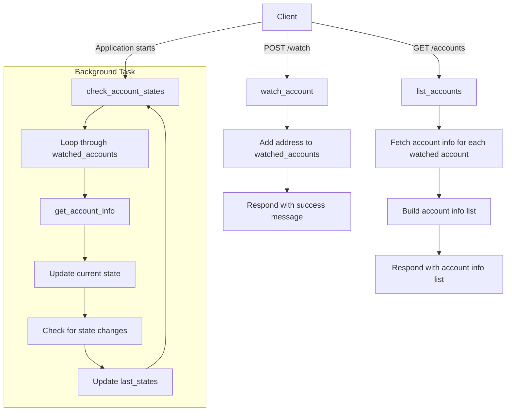

# Algorand Account Watcher

This application allows users to monitor Algorand account addresses by adding them to a watcher list. It periodically checks each account's state and logs notifications when there are balance changes. The application is built using Python, Flask, and [algorand-sdk](https://developer.algorand.org/docs/sdks/python/) for seamless interaction with the Algorand blockchain.


<!-- START doctoc generated TOC please keep comment here to allow auto update -->
<!-- DON'T EDIT THIS SECTION, INSTEAD RE-RUN doctoc TO UPDATE -->
**Table of Contents**

- [Explanation](#explanation)
- [Server Setup](#server-setup)
- [Usage](#usage)
    - [Add account to the Watcher List](#add-account-to-the-watcher-list)
    - [Listing Tracked Accounts and Their States](#listing-tracked-accounts-and-their-states)
- [Monitoring](#monitoring)
- [Logging and Monitoring](#logging-and-monitoring)
- [Production Deployment](#production-deployment)
- [Testing](#testing)
- [Documentation](#documentation)
- [Limitations and future improvements](#limitations-and-future-improvements)

<!-- END doctoc generated TOC please keep comment here to allow auto update -->

## Implementation

The implementation is done using Python, Flask, and algosdk for interacting with the Algorand blockchain

* **Flask App**: We set up a simple Flask application with two endpoints:
	- `/watch`: Accepts a POST request to add an Algorand address to the watcher list.
	- `/accounts`: Lists all tracked accounts and their current states.
* **Background Thread**: A background thread periodically checks the state of each account every 60 seconds.
* **Logging**: We log a notification whenever a change in the balance of a watched account is detected.



## Server Setup

1. Install dependencies:

`pip install -r requirements.txt`


2. Run the application:

```bash
$ python3 watcher.py`
```

You should see output similar to:

```
 * Serving Flask app 'watcher'
 * Debug mode: off
INFO:werkzeug:WARNING: This is a development server. Do not use it in a production deployment. Use a production WSGI server instead.
 * Running on all addresses (0.0.0.0)
 * Running on http://127.0.0.1:5000
 * Running on http://192.168.4.118:5000
INFO:werkzeug:Press CTRL+C to quit
```

When an address is added to the watchlist, you will see:

```
INFO:werkzeug:127.0.0.1 - - [06/Jul/2024 22:04:25] "POST /watch HTTP/1.1" 200 -
```

When a balance change is detected, you will see:

```
INFO:root:Balance change detected for KC56T2JKU2NHPPLTVUUCO7SWAKMZKOEU3RRPA65AMJZAC2AYGNVHNQFAE4: 15000000 -> 25000000
```

## Usage

#### Add account to the Watcher List

- Endpoint: `/watch`
- Method: POST
- Body: `{"address": "your_algorand_address"}`

Send a POST request to /watch with the Algorand address you want to add to the watcher list. You can use curl, Postman, or any other API client.

Example using curl:

```bash
$ curl -X POST http://127.0.0.1:5000/watch -H "Content-Type: application/json" -d '{"address": "KC56T2JKU2NHPPLTVUUCO7SWAKMZKOEU3RRPA65AMJZAC2AYGNVHNQFAE4"}'
```

Will output:

```json
{
  "message": "Watching address KC56T2JKU2NHPPLTVUUCO7SWAKMZKOEU3RRPA65AMJZAC2AYGNVHNQFAE4"
}
```

#### Listing Tracked Accounts and Their States

- Endpoint: `/accounts`
- Method: GET

Send a GET request to `/accounts` to retrieve the list of tracked accounts and their current states.

Example using curl:

```bash
curl http://127.0.0.1:5000/accounts
```

Reply will be similar to this, where we are watching 2 accounts, and latest states of each are returned.

```json
[
  {
    "address": "KC56T2JKU2NHPPLTVUUCO7SWAKMZKOEU3RRPA65AMJZAC2AYGNVHNQFAE4",
    "amount": 25000000,
    "amount-without-pending-rewards": 25000000,
    "apps-local-state": [],
    "apps-total-schema": {
      "num-byte-slice": 0,
      "num-uint": 0
    },
    "assets": [],
    "created-apps": [],
    "created-assets": [],
    "min-balance": 100000,
    "pending-rewards": 0,
    "reward-base": 27521,
    "rewards": 0,
    "round": 41643639,
    "status": "Offline",
    "total-apps-opted-in": 0,
    "total-assets-opted-in": 0,
    "total-created-apps": 0,
    "total-created-assets": 0
  },
  {
    "address": "GD64YIY3TWGDMCNPP553DZPPR6LDUSFQOIJVFDPPXWEG3FVOJCCDBBHU5A",
    "amount": 138471012550051,
    "amount-without-pending-rewards": 138471012550051,
    "apps-local-state": [],
    "apps-total-schema": {
      "num-byte-slice": 0,
      "num-uint": 0
    },
    "assets": [
      {
        "amount": 10112140146,
        "asset-id": 10458941,
        "is-frozen": false
      }
    ],
    "created-apps": [],
    "created-assets": [],
    "min-balance": 200000,
    "pending-rewards": 0,
    "reward-base": 27521,
    "rewards": 5502973260927,
    "round": 41643639,
    "status": "Offline",
    "total-apps-opted-in": 0,
    "total-assets-opted-in": 1,
    "total-created-apps": 0,
    "total-created-assets": 0
  }
]
```

## Monitoring and Logging

The application checks the state of each watched account every 60 seconds and logs any detected changes.

The application logs notifications whenever there is a change in the state of a watched account (including a balance change). You can view these logs in the console where the application is running.

The application also logs the following events:

* **New Account to watch**. Example LOG: `INFO:werkzeug:127.0.0.1 - - [06/Jul/2024 22:34:03] "POST /watch HTTP/1.1" 200 -`

* **Received request to list all tracked accounts and their current states**.
 Example log: `INFO:werkzeug:127.0.0.1 - - [06/Jul/2024 22:32:18] "GET /accounts HTTP/1.1" 200 -`.

* **Detected change in balance**. Example log: `INFO:root:Balance change detected for KC56T2JKU2NHPPLTVUUCO7SWAKMZKOEU3RRPA65AMJZAC2AYGNVHNQFAE4: 15000000 -> 25000000`

## Production Deployment

The current setup is for development purposes. For production deployment, consider using a WSGI server like Gunicorn.

Install Gunicorn:

```sh
pip install gunicorn
```

Run the application with Gunicorn:

```sh
gunicorn -w 4 watcher:app
```

This example command starts the application with 4 worker processes, which is suitable for handling more concurrent requests in a production environment.

## Testing

A github action runs tests on the code on each commit on this repository.

You can also run the tests manually with `pytest` or `python ./tests/test_watcher.py`.

```bash
$ pytest
============================================ test session starts ============================================
platform linux -- Python 3.10.12, pytest-8.2.2, pluggy-1.5.0
rootdir: /home/alejandro/git/algorandwatcher
plugins: anyio-4.4.0, requests-mock-1.12.1
collected 3 items

tests/test_watcher.py ...                                                                             [100%]

============================================= 3 passed in 0.58s =============================================
```

 ```bash
$ python3 ./tests/test_watcher.py
2024-07-09 18:25:40,617 - INFO - Fetched account info for test-address
..2024-07-09 18:25:40,618 - INFO - Started watching address test-address
.
----------------------------------------------------------------------
Ran 3 tests in 0.004s

OK

 ```

## Documentation

Documentation is automatically generated from code using [Sphinx](https://www.sphinx-doc.org).

The HTML version of the docummentaion is in the `docs` folder and can be updated anytime by runnig `make html` from the docs folder.

A github action, executes this command after each commit and published the docs here: [https://criadoperez.gihub.io/algorand_account_watcher](https://criadoperez.gihub.io/algorand_account_watcher)

## Limitations and future improvements

The application has the following known limitations that we can improve in future versions:

* **Checking only balance**. Currently we are only controlling changes in `amount`, which is the balance of the account. Other states of the account, like `assets`, `created-apps` and others and not.
* **Data persistence**. Accounts and states are stored in memory. If accounts to watch need to be monitored for long periods, a more permanent storage should be considered.
* **API security**. Current implementation does not include any form of authentication or rate limiting, which can expose the service to abuse.
* **Environment file**. Algorand node address and token are hardcoded in the code. This could be moved to an environment file if code is expected to get shared.
* **Scalibility**. Current single-threaded implementation is not scablable. For high loads message queue could be considered or the using of a WSGI server like a [Gunicron](https://gunicorn.org/).
